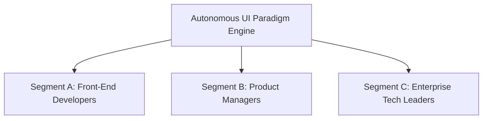

# Strategic Architecture Directive: Autonomous UI Paradigm

**Live URL**: [https://b2-b-developer.vercel.app/](https://b2-b-developer.vercel.app/)

The **Autonomous UI Paradigm** must be analyzed not merely as another front-end component library or static UI framework, but as an infrastructure-level intervention designed to solve the structural "Monolithic User Journeys," "Closed-World Rigidity," and "Local Maxima Entrapment" plaguing the modern Digital Product Design landscape.

Here is the MECE categorical breakdown of the Autonomous UI Paradigm’s architectural framework, isolating its market mechanics and system design.

## 1. Value Proposition Narrative
The architectural alignment of the Autonomous UI Paradigm’s core mission and positioning.

### I. Core Value Creation
* **Product-Market Fit**: The contemporary software sector suffers from rigid, hard-coded interfaces, rendering adaptation to user friction increasingly slow, expensive, or difficult to execute. This creates a profound mismatch between evolving user behaviors and legacy static applications. The Autonomous UI Paradigm achieves direct product-market fit by acting as a dynamic, generative compilation engine. It decouples interface rendering from manual design cycles, transforming fragmented telemetry data into structured, highly optimized UI variants on the fly.
* **Customer Demand**: There is an escalating demand from Product Teams and Developers to find high-signal, frictionless paths to eliminate drop-off, establish verifiable proof of user engagement, and escape the inherent risk of shipping stagnant features. Users require a systematic framework to identify where UX friction exists. The Autonomous UI Engine captures this demand by giving them a clear directive: autonomously restructure the UI based on real-time data, or fundamentally pivot the interaction model based on external market context.
* **Competitive Differentiation**: Legacy solutions and platforms function as passive analytics dashboards or A/B testing hubs, requiring manual, high-friction engineering effort to extract value and implement changes. The Autonomous UI Paradigm differentiates by being structurally reactive and generative. It inherently maps the contextual landscape by positioning self-compiling interfaces as direct counterweights to static incumbent benchmarks, providing instant contextual clarity through immediate, code-free UI generation.

### II. Go-to-Market Execution
* **Marketing & Awareness**: The narrative centers around "Self-Optimizing Interfaces." Marketing focus is heavily weighted toward relieving the friction of design debt for Product Teams, while showcasing an actionable blueprint for Engineering Leaders looking to mobilize generative AI against rigid legacy codebases.
* **Sales & Distribution**: The Autonomous UI Paradigm distributes to autonomous developers as a high-fidelity utility and verifiable telemetry engine (B2D/PLG), while positioning itself to Enterprise Product Organizations as a systemic pipeline for continuous UX optimization and accelerated growth (B2B).
* **Onboarding & Implementation**: The platform is engineered to integrate with minimal friction. The core onboarding experience fast-tracks users into clear, actionable, and structured pathways: injecting internal telemetry, feeding external market data, or executing strategic pivots, immediately updating the application's global interface rendering layer.

### III. Customer Experience
* **Quality & Reliability**: Because the application serves as a comprehensive engine tracking real-time user behavior, market context, and strategic intent, low-latency state updates, precise telemetry categorization, and secure compilation protocols form its baseline infrastructure.
* **Ease of Use**: The architecture prioritizes rapid compilation and deployment. It eliminates the traditional, intimidating overhead of navigating complex design sprints and PR reviews. By condensing optimization into a few simple, high-impact autonomous actions, the engine lowers the cognitive barrier to entry and translates data into immediate UI adaptation.
* **Support & Services**: For active operators and product managers, support is realized through comprehensive system consoles. These interfaces track engine logic, simulated thought processes, and overall compilation velocity against target benchmarks.

### IV. Loyalty & Engagement
* **Switching Costs**: Once a team establishes a verifiable, self-optimizing application environment within this generative matrix, and product managers depend on its systemic optimization pipeline, migrating back to isolated, manual design tools introduces prohibitive cognitive and engineering equity loss.
* **Network Effects**: As more telemetry profiles engage with the Autonomous UI Engine, the engine's comprehensive registry of optimal UX patterns expands exponentially. Every new friction loop resolved or alternative interface generated scales the overall intelligence surface area, attracting a denser pool of edge cases and multiplying the collective utility of the entire generative ecosystem.

---

## 2. G.E.M.S.G. Stakes at Play
The systemic macro-stakes of transforming the digital product architecture.

| Stake | Definition |
| :--- | :--- |
| **Governance** | Algorithmic transparency and control over UI compilation rules |
| **Economics** | Maximizing engineering yields by eliminating manual design debt |
| **Modernization** | Shifting from legacy static codebases to generative, self-compiling environments |
| **Sociology** | Decentralizing product optimization away from siloed design gatekeepers |
| **Growth** | Compounding global UX pattern intelligence loops |

### I. Core Value Creation
* **Product-Market Fit (The Modernization Stake)**: The historical model of manual UX/UI updates is structurally inefficient, chronological, and siloed. The Autonomous UI Paradigm addresses the Modernization stake by replacing fragmented design sprints with a structured, data-aligned model where interfaces are explicitly defined by their relationship to real-time user friction.
* **Customer Demand (The Economic Stake)**: Macroeconomic pressure for hyper-efficiency has commoditized traditional engineering tasks, leaving vast pools of developer time bogged down in UI tweaks. The Autonomous UI Paradigm addresses the Economic stake by unlocking a structured mechanism for teams to invest their resources directly into higher-order logic, transforming unutilized potential into product innovation.
* **Competitive Differentiation (The Sociological Stake)**: Rather than allowing central design gatekeepers to dictate iteration speed and cost, the Autonomous UI addresses the Sociological stake by democratizing the capability to build optimal experiences autonomously. It provides the collective architecture required to systematically challenge static products through data-driven, generative structures.

### II. Go-to-Market Execution
* **Sales & Distribution (The Governance Stake)**: As AI generation, data provenance, and algorithmic stewardship face unprecedented scrutiny, the Autonomous UI positions itself as a clean, transparent logic layer. By maintaining explicit engine logs between telemetry inputs and UI outputs, it offers a transparent, trusted infrastructure for generative distribution.

### III. Customer Experience
* **Ease of Use (The Sociological Stake)**: The platform democratizes complex system coordination. If an interface requires technical mastery of deep codebases or manual CSS grids to update, it fails the modern product team. The platform honors intuitive intent immediately, turning a basic human urge—fixing user friction—into a frictionless digital standard.

### IV. Loyalty & Engagement
* **Network Effects (The Growth Stake)**: The target demographic represents an indispensable pillar of the modern software market. The Autonomous UI Paradigm scales by compounding individual UI adaptations into a unified, multi-directional web of best practices. This network unlocks non-linear growth paths, where every new telemetry node added expands the optimization surface area for the entire user base.

---

## 3. User Segments Using the App

**Segment A: Front-End Developers (Active Executors)**
* **Core Driver**: Securing high-impact alignment, eliminating mundane UI ticket work, and executing meaningful feature architecture without navigating traditional design gatekeepers.
* **Value Mapping (Ease of Use)**: They require high-signal compilation and rapid deployment. The Autonomous UI serves them by providing instantaneous access to active UI generation, matching their precise codebase to live market needs without manual intervention.

**Segment B: Product Managers (Initiative Leads)**
* **Core Driver**: Validating a clear market demand for their features, crowdsourcing high-caliber behavioral data, and establishing a highly optimized user journey against existing incumbents.
* **Value Mapping (Product-Market Fit)**: They require immediate ecosystem feedback and structural adaptation. The platform enables them to inject telemetry directly into the engine, instantly elevating their product's usability to a global community of users.

**Segment C: Enterprise Tech Leaders (Systemic Stewards)**
* **Core Driver**: Securing product longevity, tracking parity metrics against external competitors, and maintaining a constant stream of verified UX optimizations to secure long-term market dominance.
* **Value Mapping (Competitive Differentiation)**: They utilize the platform as a persistent product adaptation layer. It allows them to position their dynamic applications as ready alternatives to volatile legacy options, ensuring a resilient operational roadmap that automatically absorbs external shocks (like new biometric hardware).

---

## 4. Fundamental Market Forces
The systemic macro-pressures driving adoption and commercial validation.

### I. Core Value Creation
* **The Industry Volatility Inflection Point (Product-Market Fit)**: Widespread market shifts and hardware innovations have left massive static codebases looking for alternative avenues to stay relevant. This shift drives an active demand vector for open, self-compiling production networks. The Autonomous UI captures this shift, providing an intentional framework for autonomous product evolution.
* **The Sovereignty/Decentralization Maturity (Customer Demand)**: The market demands transparency, architectural security, and cost-resilient alternatives as engineering costs escalate and static frameworks face instability. The Autonomous UI satisfies this reality by turning generative AI into a systematic pipeline for producing robust, self-healing interfaces.

### II. Go-to-Market Execution
* **The Ecosystem Fragmentation Squeeze (Sales & Distribution)**: The modern front-end landscape is heavily fractured across disparate component libraries, analytics tools, and undocumented UI states. The market demands an expressive middleware that can knit these multi-format fragments together. The Autonomous Engine steps into this void, serving as an interactive compiler for active telemetry and distributed user states.

### III. Customer Experience
* **Frictionless Contribution/Action Expectations (Ease of Use)**: Modern users judge applications by how rapidly they adapt to their needs. Systems that require tedious manual updates slow momentum. The Autonomous UI capitalizes on the market pressure for responsive tools by making product evolution and competitive pivoting intuitive and instantaneous.

### IV. Loyalty & Engagement
* **The Paradigm Shift Toward Unified Graph Networks (Switching Costs)**: The industry is transitioning away from unquestioned reliance on siloed design tools toward collaborative, interconnected generative ecosystems. By organizing development around relational, data-indexed adaptations, the Autonomous UI builds a highly resilient repository for global product value, positioning itself as a durable utility for tracking industry trends.

---

### Systemic Takeaway
The **Autonomous UI Paradigm** wins the marketplace by transforming fragmented software engineering into a highly structured, market-aligned ecosystem for generative product synthesis. It rebalances the industry's landscape: giving Front-End Developers their agency and architectural freedom back, giving Product Managers a responsive environment to scale usability, and giving the Global Tech Landscape an enduring framework where digital products are enriched and continuously accelerated by their explicit, autonomous relationship to real-time market friction.
